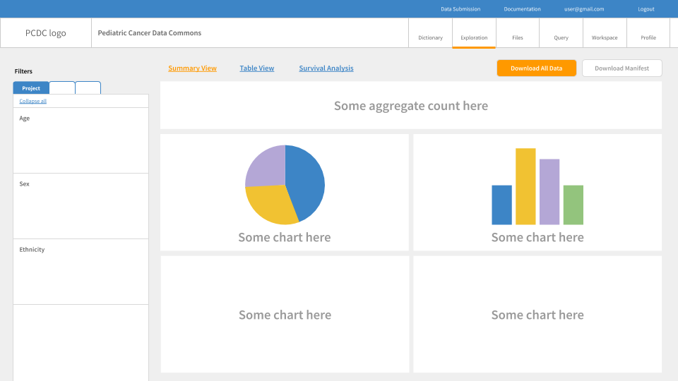
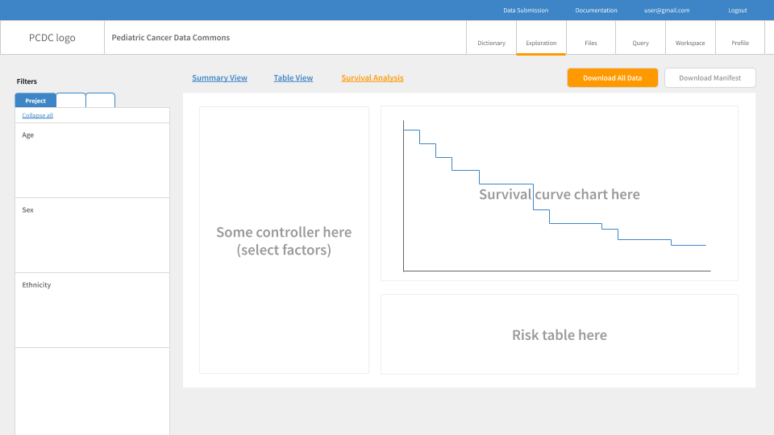

# PCDC Survival Analysis Requirements

This living document serves as a reference point for the requirements for designing and implementing survival analysis tool.

## Overview

### Architecture

The survival analysis tool can be seen as a combination of the following elements:

- React Component
  - A UI component that 1) allows users to specify filters and stratifying factors to use, 2) sends HTTP request to Microservice with the user input, 3) fetches the response JSON data from Microservice, and 4) generates/updates the data visualization using the fetched data.
  - React Component consists of three UI child components: 1) a controller to set stratifying factors to use, 2) a survival curve plot, and 3) a risk table.
- Microservice
  - A newly created web service that 1) listens to HTTP requests with user input (filters and stratifying factors) as a payload, 2) fetches the data from Data Source with the filters, 3) fit survival curve to the fetched data with the stratifying factors, and 4) serve the fitted data to the client as the payload for HTTP response.
- Data Source
  - A database or an intermediary service that responds to database queries.

### Workflow

The following diagram demonstrates the expected task workflow of the survival analysis tool:


1. User input is provided (i.e. changes in filters and/or stratifying factors to use), triggering Step 2
2. React Component sends HTTP request to Microservice with the user input as a payload
3. Microservice constructs data query using filters and sends it to Data Source
4. Data Source sends query result to Microservice
5. Microservice fits a survival curve (Kaplan-Meier estimator) using the stratifying factors to the fetched query result and packages the output as a JSON object including survival probability data, risk table data, and log-rank test p-value (if relevant)
6. Microservice sends HTTP response to React Component with survival analysis output in JSON as a payload
7. React Component generates/updates data visualization using the fetched survival analysis output

## React Component

Survival analysis tool's React Component will be part of the `<GuppyDataExplorer>` component of PCDC's Gen3 data portal.

`<GuppyDataExplorer>` includes two child components, `<ExplorerFilter>` and `<ExplorerVisualizations>`, and the survival analysis React Component will be part of `<ExplorerVisualizations>`. More specifically, React Component will be implemented so that it is one of the tabs on `<ExplorerVisualizations>`.

The tab UI is currently not available for `<ExplorerVisualizations>` but is expected to look like the following figures once implemented:





React Component will be what is displayed on the "Survival Analysis" tab in the figures above.

### Features

React Component must include main features of the existing INRG survival analysis tool the new tool replaces in addition to some improvements (for performance, interactivity, etc.).

The following features and functionalities are required of React Component:

- Access to the filter values set by users via `<ExplorerFilter>` UI
- A child component to receive user input for stratifying factors for survival curve
- A child component to display survival curve chart
  - Using [Recharts](http://recharts.org/en-US) is recommended for drawing the survival curve chart as it is an existing dependency
  - It is highly desirable for the survival curve chart to support interactive elements, e.g. showing tooltips on hover
  - X axis is time in year; its ticks should be integer values for year
  - Y axis is survival probability
- A child componet to display risk table
  - Each row should be at risk count for each stratum
  - Interval should be time in year
  - It is highly desirable for the risk table to be a chart with the same X axis as survival curve chart above
- A child component to display log-rank test p-value if available (i.e. when more than one strafiying factor is provided; not shown in the figure above)

## Microservice

Survival analysis tool's Microservice is a newly developed microservice added to the Gen3 infrastructure and responsible for fitting survival curve (Kaplan-Meier estimator) to project data fetched from Data Source according to the user input provided by React Component.

For successful integration with the existing Gen3 platform, Microservice needs to implement some boilerplate code. See [this repository](https://github.com/chicagopcdc/PcdcAnalysisTools) for the work in progress.

### Request API

**:warning: Request API is currently not stable.**

Microservice listens to POST request with the payload in JSON of the following shape:

```jsonc
{
  "patientSearchCriteria": {
    // as constructed by <ExplorerFilter>
    "query": "",
    "variables": {
      "filter": {
        // ...
      }
    }
  },
  "factorVariable": "foo", // main treatment variable
  "stratificationVariable": "bar", // additional stratifying variables
  "efsFlag": false, // flag for evant-free survival (EFS)
  "startTime": 0,
  "endTime": 10
  // "timeUnit": "year" // not relevant for v1.0 release
}
```

#### Discussions

- Should `factorVariable` allow for multiple values?
  - Survival analysis models often distinguish one key covariate (treatment), whose effect size is of main interest, and other confounders to adjust for. (The distinction is informal--i.e. for interpretation only.) Accordingly, it may not be sensible for `factorVariable` to have multiple inputs.
- Should `factorVariable` and `stratificationVariable` be renamed?
  - In terms of fitting survival curves, `factorVariable` and `stratificationVariable` are both covariates without any formal difference. Meanwhile, in the reference tool for INRG, `stratificationVariable` does double duty as it is also used to facet the survival curves into multiple panels. Renaming/restructuring them to, for instance, `factorVariable` and `facetVariable` and making `facetVariable` only responsible for the visual aspect of the survival curve may help clarifying the role of each input.
  - If the input value for `**Variable` is an array, using the plural form may serve as a more descriptive name.
- Should `time_unit` allow for value other than "year"?

### Response API

**:warning: Response API is currently not stable.**

Microservice sends response with data in JSON of the following shape:

```jsonc
{
  "pval": ,     // p-value of log-rank test; float if available, null otherwise
  "risktable": [
    {
      "n": ,    // count; int
      "year": , // time in year; float
    }
  ],
  "survival": [
    {
      "prob": , // survival probability; float
      "time":   // time in year; float
    }
  ]
}
```

## Resources

- Proof-of-concept for React Component ([GitHub](https://github.com/bobaekang/poc-survival-react-component))
- Proof-of-concept for drawing survival curve
  - Using [Recharts](http://recharts.org/en-US) and [React](https://reactjs.org/) ([GitHub](https://github.com/bobaekang/react-recharts-survival-curve))
  - Using [D3](https://d3js.org/) and [React](https://reactjs.org/) ([GitHub](https://github.com/bobaekang/react-d3-survival-curve))
  - Based on [Survival (Clinical) of Live Cancer Explorer](https://qbrc.swmed.edu/projects/liverspore/multi_group_survival.php) by UT Southwestern Medical Center
- Proof-of-concept for Microservice ([GitHub](https://github.com/bobaekang/poc-survival-microservice))
- Microservice work-in-progress repository ([GitHub](https://github.com/chicagopcdc/PcdcAnalysisTools))
  - Using [sheepdog](https://github.com/uc-cdis/sheepdog/) codebase as a template
  - Repo currently private
